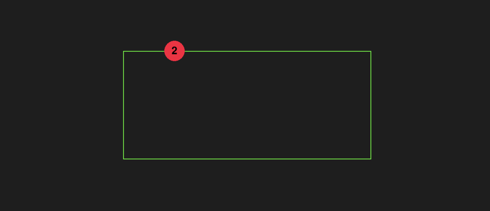

# Box Breather

A Python script that animates a circle moving around a box with customizable parameters, built using Pygame.

## Installation

1. **Clone the Repository**

   Use `git clone https://github.com/nebulou5/box-breather.git` to clone the repository, then `cd box-breather` to enter the directory.

2. **Install Dependencies**

   Run `pip install pygame` to install Pygame. Ensure you have Python 3 installed before running this command.

## Running the Script

The script can be run with command-line arguments or a config file. The circle moves in a box, growing in size along the top horizontal leg, staying large on vertical legs, and shrinking along the bottom horizontal leg.

### Command-Line Options

1. **Single Duration**

   All legs use the same duration (in seconds): run `python box_breather.py 2`.

2. **Horizontal and Vertical Durations**

   First number for horizontal legs, second for vertical: run `python box_breather.py 2 3`.

3. **Individual Leg Durations**

   Four numbers for each leg (top-left to top-right, top-right to bottom-right, bottom-right to bottom-left, bottom-left to top-left): run `python box_breather.py 1 2 3 4`.

4. **Using a Config File**

   Specify a config file with `--config`: run `python box_breather.py --config=config.txt`.

### Config File Usage

Create a text file (e.g., `config.txt`) with one option per line in `key=value` format. Example:

`leg1_time=1`  
`leg2_time=2`  
`leg3_time=3`  
`leg4_time=4`  
`background_color=255,255,255`  
`box_color=0,0,0`  
`circle_color=255,0,0`  
`box_width_percent=0.5`  
`box_height_percent=0.5`  
`box_thickness=2`  
`circle_start_radius=20.0`  
`circle_end_radius=60.0`

Run with: `python box_breather.py --config=config.txt`.

#### Configuration Parameters

- `leg1_time`: Duration (seconds) for top-left to top-right
- `leg2_time`: Duration (seconds) for top-right to bottom-right
- `leg3_time`: Duration (seconds) for bottom-right to bottom-left
- `leg4_time`: Duration (seconds) for bottom-left to top-left
- `background_color`: RGB tuple (e.g., `255,255,255` for white)
- `box_color`: RGB tuple (e.g., `0,0,0` for black)
- `circle_color`: RGB tuple (e.g., `255,0,0` for red)
- `box_width_percent`: Box width as a percentage of window width (0.0 to 1.0)
- `box_height_percent`: Box height as a percentage of window height (0.0 to 1.0)
- `box_thickness`: Box outline thickness in pixels
- `circle_start_radius`: Initial circle radius (float)
- `circle_end_radius`: Maximum circle radius (float)

### Notes

- If no arguments or config file is provided, defaults to 2 seconds per leg with standard colors and sizes.
- Window is resizable; box and circle adjust smoothly.
- Press ESC or close the window to exit.
